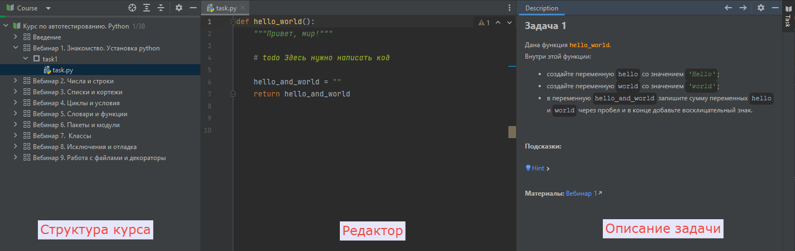

<html>

<head>
  <meta charset="utf-8" />
  
 </head>
<h2>Как пользоваться</h2>

Курс состоит из серии вебинаров, каждый из которых содержит задачи.

При открытии задачи есть 3 основных рабочих области:

<ul>
<li>слева - структура курса;</li>
<li>по центру - редактор;</li>
<li>справа - описание задачи.</li>
</ul>

 

Решение задач будет происходить следующим образом:
<ul>
<li>выбираете вебинар, который хотите изучить;</li>
<li>открываете файл с задачей;</li>
<li>читаете описание задачи;</li>
<li>в редакторе пишете решение;</li>
<li>запускаете автоматическую проверку задачи с помощью кнопки "Сheck" на панели с описанием задачи.</li>
</ul>

Далее рассмотрим подробнее каждую из 3 рабочих областей и их возможности.

</html>