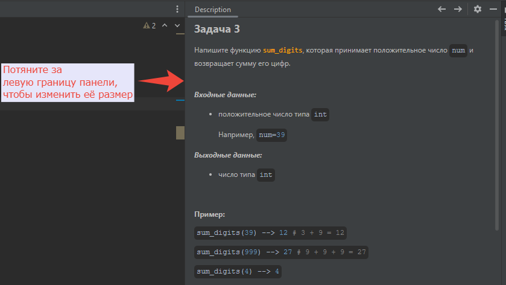
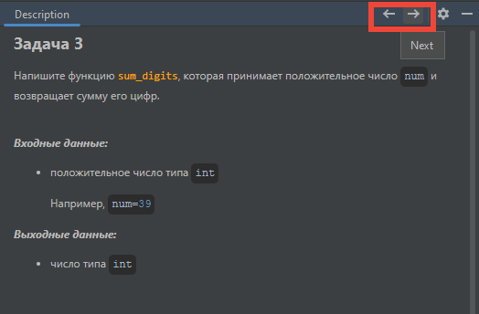
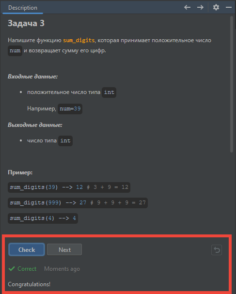
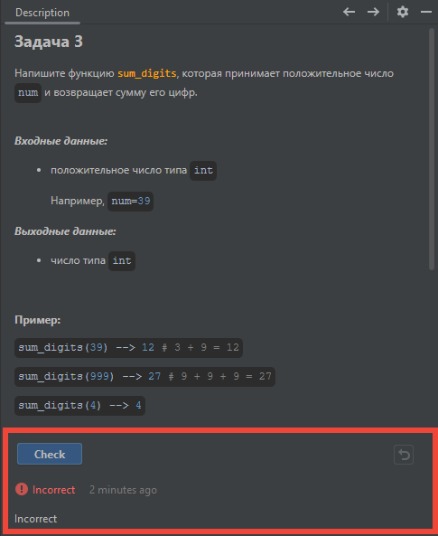
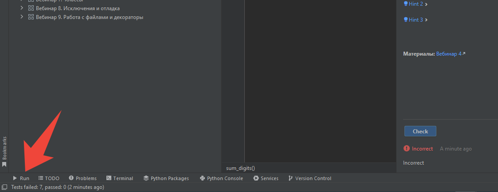
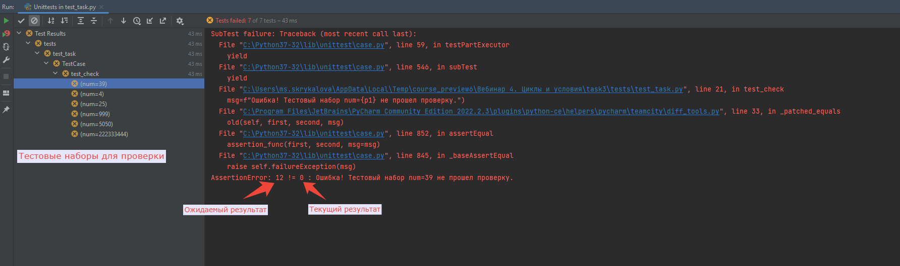

<html>
<head>
  <meta charset="utf-8" />
  
 </head>
<h2>Описание задачи</h2>

На панели с описанием задачи содержится вся информация, необходимая для выполнения задачи.

Размер панели можно увеличить или уменьшить, зажав указатель мыши за левую границу панели и потянув в сторону.

 

Чтобы переключаться между задачами, можно использовать стрелки вправо/влево на панели 
или дважды кликнуть по нужному файлу с задачей <b>task.py</b> в структуре курса.

 

В описании задачи есть:

<ul>
<li>формулировка задания;</li>
<li>входные и выходные данные;</li>
<li>примеры;</li>
<li>подсказки;</li>
<li>учебные материалы;</li>
<li>автоматическая проверка решения задачи.</li>
</ul>

Рекомендуем пользоваться подсказками, только когда закончились свои идеи. 
Прежде всего попробуйте решить задачу самостоятельно.

Правильность выполнения задачи можно проверить с помощью кнопки "Check" внизу панели.

Если задача решена правильно, то будет выведен результат <b>Correct</b>.

 
 Если задача не прошла проверку, то вы получите результат <b>Incorrect.</b>

 

В тулбаре внизу нажмите "Run", чтобы посмотреть подробности падений.

 

Слева будут отображаться тестовые наборы, на которых проверяется решение задачи. 
Кликните по любому из них. 
В области справа откроется подробная информация об ошибке. Вы увидите текст ошибки вида 
"Ошибка! Тестовый набор не прошел проверку." Слева - ожидаемый результат, 
справа - текущий результат выполнения программы.

 
<b>Задание считается выполненным, если все тестовые наборы проходят успешно 
и получен статус <b>Correct</b>.</b>

 

</html>