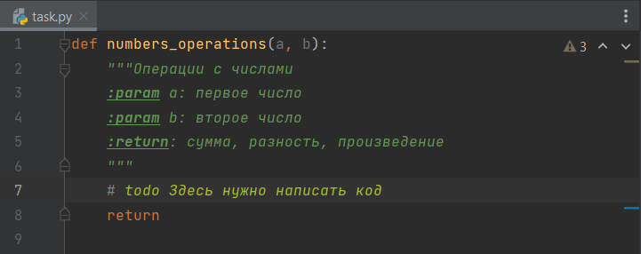
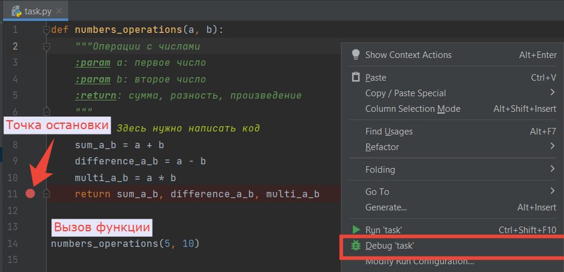
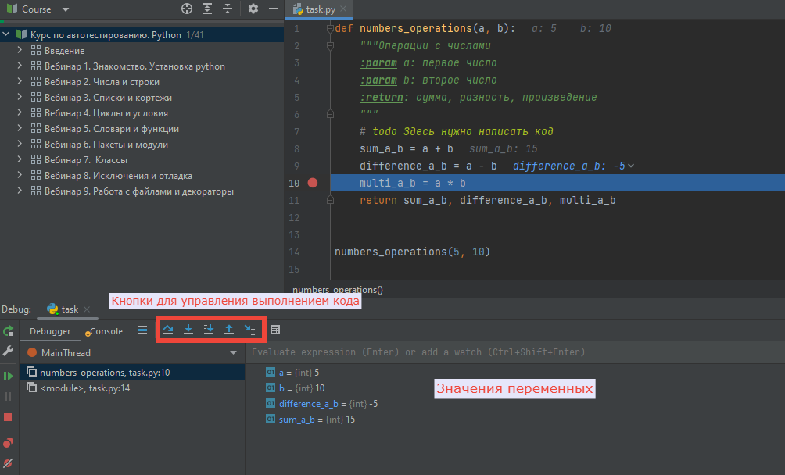
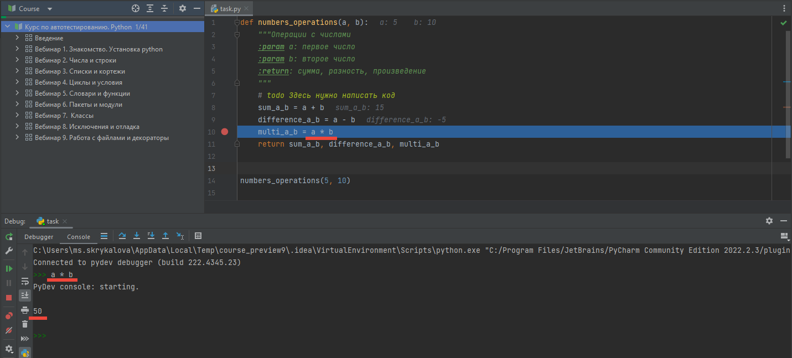

<html>
<head>
  <meta charset="utf-8" />
  
 </head>
<h2>Редактор</h2>

Редактор — это ваша рабочая область. Здесь вы будете писать код для решения задачи, отлаживаться и экспериментировать.

В задачах, где нужно написать функцию, 
в редакторе уже подготовлена основа функции: дана
инструкция <code>def</code>, есть описание, что делает функция и её переменные.
Внутри функции, т.е. внутри инструкции <code>def</code>, там, 
где указана метка <code># todo</code>,
нужно написать свой код для решения задачи. 

Примечание <code># todo</code> можно оставить, а можно удалить. 
Это не влияет на исполнение кода и является разновидностью комментария.

Чтобы проверить свой код шаг за шагом и отладиться, 
поставьте точки остановки на нужной строке рядом с номером строки. 
Ниже после тела функции <b>напишите вызов функции</b>, передав ей значения при необходимости.

Запустите код в режиме отладки. 
Для этого кликните правой кнопкой мыши в любом месте редактора 
и выберите в контекстном меню пункт <b>«Debug».</b>

 

Внизу откроется отладчик на вкладке Debugger. В области справа отобразятся все доступные в текущий 
момент переменные, их значения и другие объекты. Управлять дальнейшим выполнением кода можно с помощью кнопок тулбара
или горячими клавишами. Из часто используемых:

<ul>
<li> F7 - перейти внутрь текущего метода;</li>
<li> F8 - выполнить текущий метод и остановиться после его выполнения;</li>
<li> F9 - продолжить выполнение программы до следующей точки остановки или до завершения.</li>
</ul>

 

На вкладке Console можно в текущей области видимости работать со всеми доступными переменными, выполнять код 
и проверять интересуемую информацию. Для этого напишите в Console строку кода, нажмите клавишу Enter и получите результат
выполнения кода здесь же.

 

Подробнее про отладку можно прочитать в документации 
<a href="https://n.sbis.ru/shared/disk/c9486968-0a43-44a6-90f7-a805ac8811ce">Исключения. Отладка.</a> в разделе "Отладка".

</html>