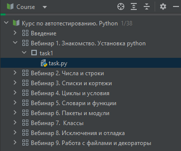

<html>
<head>
  <meta charset="utf-8" />
  
 </head>
<h2>Структура курса</h2>
Структура курса показывает программу курса: список уроков с заданиями.

Вы можете перейти к любой задаче, дважды щелкнув по файлу с задачей <b>task.py</b>.

Если вы хотите свернуть окно со структурой курса, 
чтобы освободить больше места для редактора и окна с описанием задачи, 
нажмите клавиши <a>ALT+1</a>. Таким же образом можно вернуть скрытое окно обратно.

</html>